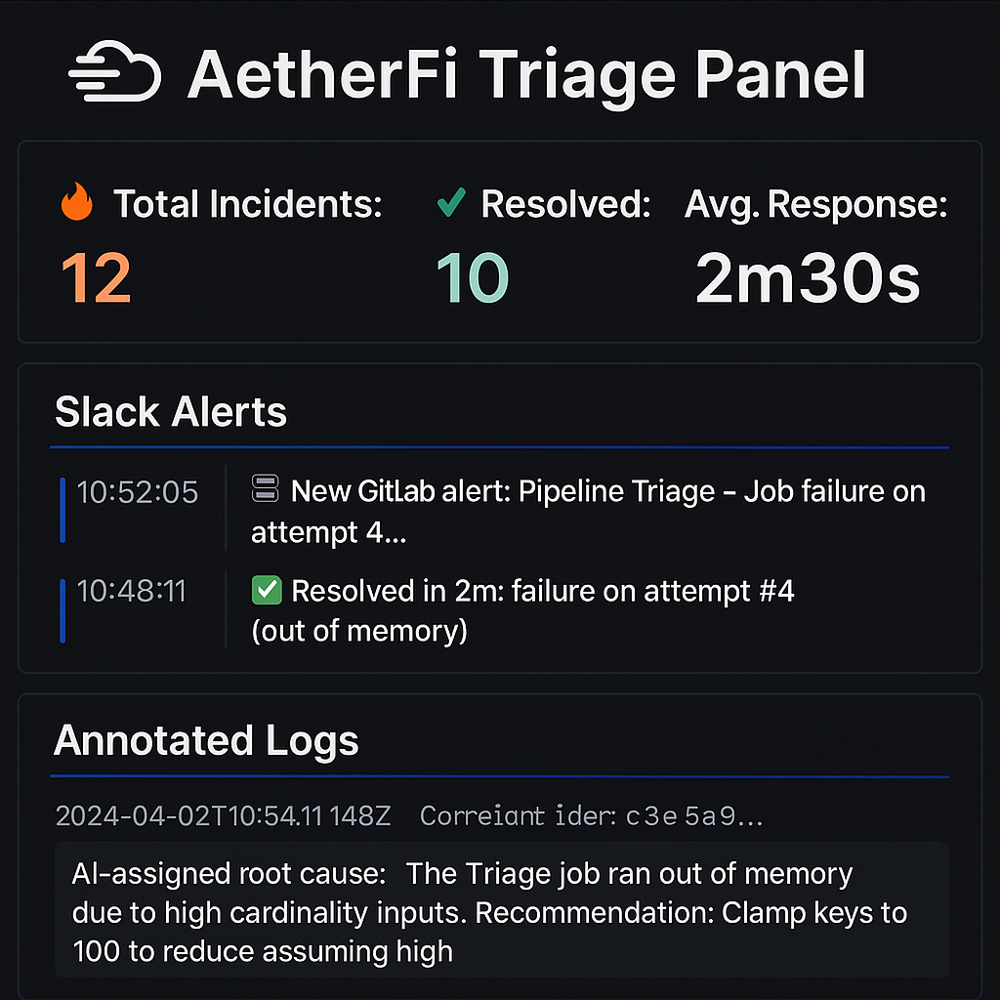

# AetherFi — AI-Native Fintech Debugging Platform

  
  
  
  
  
  
  
  
  
  
  
  

---

## 🧠 Overview

**AetherFi** is a modular, event-driven platform for **AI-assisted DevOps debugging**, **risk triage**, and **FinTech intelligence automation**. It merges robust microservice architecture with retrieval-augmented AI workflows to reduce resolution time and improve infrastructure observability.

> 🔒 This GitHub repo is a public mirror.  
> Production codebase is hosted privately on GitLab and deployed to AWS via GitLab CI/CD.

As part of AetherFi, we’ve developed **Eidolon** — a retrieval-native AI agent responsible for memory, inference, and human feedback loops. Eidolon powers the platform’s **RAG pipeline** (Retrieval-Augmented Generation), enabling traceable debugging across incidents, CI/CD logs, and infrastructure events.

Together, AetherFi + Eidolon follow a **retrieval-first architecture**, combining:
- **ETL pipelines** for structured ingestion,
- **RAGOps** patterns for monitoring AI workflows, and
- **RAR feedback loops** (Retrieval-Augmented Reasoning) for explainable decision-making.

This design prioritizes **auditability, low-latency resolution**, and **human-in-the-loop moderation** via tools like Slack and Notion | Jira (planned).

---

## 🔍 What It Does

* 🔄 Webhook-to-Kafka async triage flows
* 🧠 AI memory recall with RAG + VectorDB (Qdrant)
* 🧪 RAR (retrieval-augmented reasoning) experimental workflows (planned)
* 🔐 Multitenant observability with correlation + trace ID
* 🛠️ FAANG-grade DI, Flyway migrations, Terraform IaC
* 📈 Dashboards: Prometheus + Grafana (mocked + planned)
* 💾 Planned: Datalake ingestion and ETL pipeline for future self-hosted memory

---

## 🧩 System Architecture

<strong>Technical Stack</strong>

#### 📚 System Component Breakdown

| Layer             | Description                                                             |
| ----------------- | ----------------------------------------------------------------------- |
| **Infra**         | Terraform-managed AWS stack (ECS, Route 53, S3, CloudWatch); GitLab CI  |
| **Orchestration** | Java-based Vizier Orchestrator (Spring Boot, Resilience4j)              |
| **Agent Layer**   | Python-based Eidolon AI Agent (FastAPI, OpenAI, Claude)                 |
| **Memory Layer**  | Vector Search (Qdrant) + metadata store (Postgres) + Datalake (planned) |
| **Observability** | Prometheus, Grafana, OTel Tracing, Slack + Notion output                |
| **Security**      | OAuth2, Zero Trust, IAM Roles, Secrets Manager (planned), Jira escalation 🔜     |

📌 See full [System Architecture](docs/ARCHITECTURE.md)

---

## 🔭 Observability Highlights

* 🧠 Correlation ID tracing across Java + Python via MDC/contextvars
* 🔁 Kafka replay for event debugging
* 🛡️ Circuit breaker fallbacks with enriched error messages
* 🖥️ Dashboards: Grafana mockup + Notion/Slack alert integrations

📎 Full details: [Observability Guide](docs/OBSERVABILITY.md)

## 📊 Triage Dashboard (Mock Grafana)

This simulated panel summarizes pipeline outcomes and response time across incidents.

---

## 🗺 Roadmap

| Milestone                          | Status      |
| ---------------------------------- | ----------- |
| ✅ Webhook ingestion demo (E2E)     | Complete    |
| 🚧 Eidolon RAG agent launch        | In Progress |
| 🚧 Qdrant + Postgres orchestration | In Progress |
| 🚧 RAR inference loop (pilot)      | Planned     |
| 🚧 ETL + Datalake pipeline         | Planned     |
| 🚧 FinTech CLI (ShadowBanker)      | Planned     |
| 🚧 Observability integrations      | Planned     |

📌 See [Project Milestones](docs/E2E_TRIAGE.md)

---

## 🔧 Project Goals

* Build a **Debug-as-a-Service** (DaaS) FinTech platform
* Enforce **Zero Trust + Secrets Rotation**
* Deliver **Graph-augmented AI memory tools**
* Prototype **RAR (Retrieval-Augmented Reasoning)** agents
* Implement **Datalake + ETL** to power continuous ingest workflows
* Achieve **modular scale across microservices**
* Implement RAGOps patterns (prompt tracing, vector metrics, feedback recall)
* Scale from RAG → RAR via Slack feedback + prompt routing
* Replace Notion with Jira for advanced issue lifecycle management

---

## 📚 Deep Dives

* 📐 [System Architecture](docs/ARCHITECTURE.md)
* 🧱 [Dependency Injection Overview](docs/DI_OVERVIEW.md)
* 🗃️ [Flyway Migration Guide](docs/MIGRATIONS.md)
* 🧪 [E2E Test Architecture](docs/TESTING.md)
* 🧭 [SDLC Plan](docs/SDLC_PLAN.md)
* 📘 RAGOps Overview
* 🧩 Datalake Vision

---

## 📊 Status

> 🚧 **Active Development**
> ✅ End-to-end webhook ingestion tested
> 📎 Logs, mock dashboards, and architecture docs available

---

## 🤝 Want to Collaborate or Demo?

> 💬 Contact for demo access to private GitLab or live dashboard views.
> AI agents available for Slack/Notion observability output.

---
🔧 Test commit to verify push access
