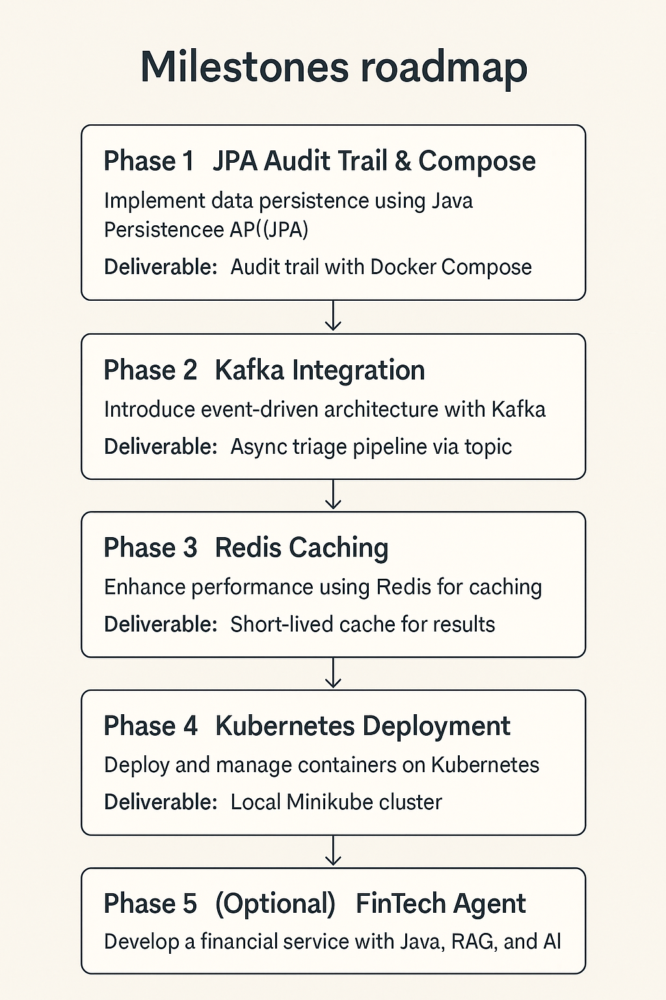
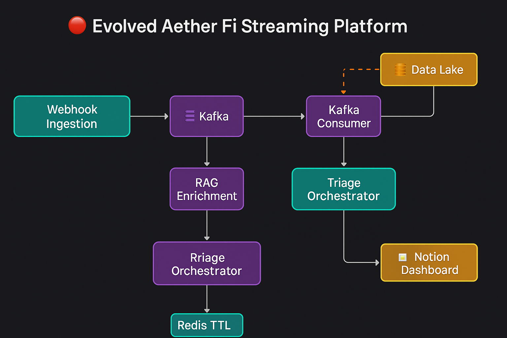
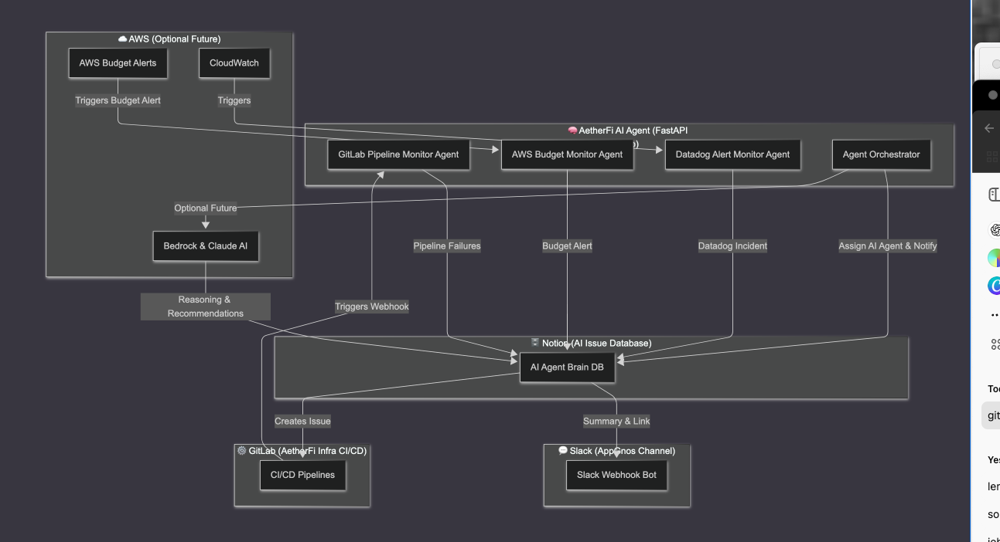

# 🧠 AetherFi System Architecture

AetherFi is a modular, AI-augmented DevOps platform designed to automate infrastructure triage, observability, and debugging workflows. It is built around event-driven microservices, multi-agent collaboration, and banking-grade deployment standards.

This document outlines the system's architecture, its migration journey from monolith to microservices, and design rationales for its core modules.

---

## 🧱 Core Architectural Principles

- **Domain-Driven Microservices**  
  Each service (e.g., Triage, Event Logging, Auth) owns a clearly defined business capability.

- **Agent-Oriented Design**  
  Autonomous agents (e.g., `GitLabPipelineAgent`) encapsulate decision logic triggered by infrastructure events.

- **Zero Trust by Default**  
  OAuth2, OIDC, IAM, and JWT are integrated at all boundaries; no implicit trust between components.

- **Event-Driven Orchestration**  
  Kafka serves as the backbone for async coordination, audit trails, and inter-service decoupling.

- **Observable by Design**  
  Circuit breakers, correlation IDs, JSON logging, metrics, and health checks are first-class citizens.

---

## 🌀 Migration: Monolith → Microservices

> AetherFi began as a single-process FastAPI monolith. It has since evolved into language-agnostic modular services (Java + Python) connected through Kafka and containerized interfaces.

### ✅ Milestones:

- Defined `pipeline_events` schema; persisted GitLab triage payloads.
- Introduced Spring Boot + JPA for transactional event storage.
- Docker Compose added for local Kafka replay testing.
- Refactored agents to use dependency injection (Python & Java).
- Kafka fan-out, vector memory, and tenant-aware RBAC in progress.

### 📊 Milestone Roadmap

> A high-level view of AetherFi's technical phases, from audit trail setup through AI-powered FinTech agents.

---

## 🧩 Modular Components

### `vizier-gateway` (Java)
- Accepts incoming API and webhook requests.
- Routes events to services and agents (Kafka producers, downstream APIs).

### `pipeline-triage-service` (Java)
- Stores `PipelineEvent` data.
- Exposes RESTful interfaces for querying pipeline metadata.

### `aetherfi-ai` (Python)
- `GitLabPipelineAgent` consumes pipeline data.
- Annotates failures, performs pattern classification.
- Sends alerts to Notion and Slack.
- Integrates Claude/Bedrock for AI-assisted triage (via structured prompts).

### `eidolon-memory` (WIP)
- Vector search over historical failures, PDFs, and architecture recaps.
- Enables RAG-powered, context-aware debugging.

---

## 🔒 Security & Reliability

- **OIDC Auth**: Federated access using GitLab & AWS IAM.
- **Circuit Breakers**: Implemented via `pybreaker` and `Resilience4j`.
- **Structured Logging**: JSON logs with CloudWatch export support.
- **Idempotency**: Events uniquely keyed via `idempotency_key` across services.

---

## 🔭 Observability Features

- **Correlation ID Propagation**: Consistent request tracking across services.
- **Kafka Replay Setup**: Docker Compose for re-ingesting real events.
- **Dashboards**: WIP Grafana + Notion boards.

### 🔄 Kafka Streaming Flow

> Shows how webhook events are pushed into Kafka, enriched via AI, and orchestrated across services for triage and Redis-based TTL caching.

---

## 🧠 AI Agent Vision

AetherFi’s long-term goal is to evolve into a true AI teammate for DevOps and FinTech:

- Ingests logs, CI/CD results, and cloud metrics.
- Cross-references historical patterns using vector memory (Qdrant).
- Proposes resolutions with traceable justifications.
- Automatically logs findings to Notion and notifies stakeholders via Slack.
  

> Illustrates a full pipeline from GitLab webhook trigger → AI agent analysis → human-in-the-loop notification with Slack and GitLab integration.

---

## 🛣️ Roadmap

- ✅ Monolith → Microservices Migration (Complete)
- 🔄 Kafka + GitLab CI Ingestion
- 🧠 RAG Memory Integration (Qdrant, Claude)
- 🧪 Secure Multi-Tenant Orchestration
- 🔔 Slack/Notion Automation
- 🌐 Public Demo Deployment

---

## 📎 References

- [`AetherFi AI Triage Agents`](AGENT.md)
- [`Flyway Migration Guide`](Flyway_Migration_Guide.md) – Versioned DDL and schema lifecycle
- [`Dependency Injection Overview`](DI_OVERVIEW.md)
- [`MILESTONES.md`](MILESTONES.md)

---

### 📐 Architecture Visuals

#### 🔁 Gateway + Redis Event Orchestration

> 🔀 This diagram illustrates AetherFi’s dual-path webhook routing: simple evaluable events are resolved via Redis/Evaluator; complex ones are escalated to Kafka and routed to AI Orchestrators. Designed for modular fallback, async retries, and low-latency responses.

--- 

#### 🧠 Full AI Agent System Flow

> Demonstrates the system-wide interaction of GitLab, AWS, Datadog, Notion, and Slack with various agents coordinating event-driven debugging.

---

> _“AetherFi isn't just a tool — it's your infrastructure apprentice.”_
