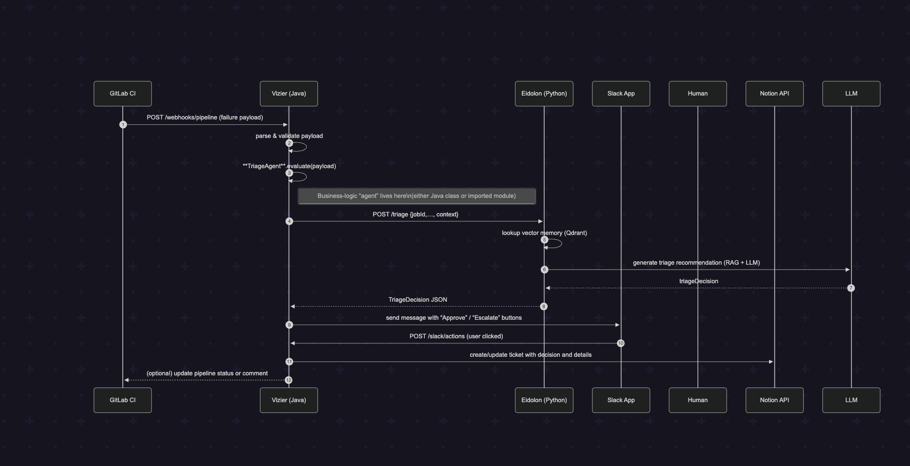

# ✅ End-to-End Pipeline Failure Triage: AetherFi AI (2025-05-04)

This document outlines the first complete, production-style end-to-end triage flow in the AetherFi AI platform, integrating:

- 🔁 GitLab CI (simulated failure)
- 🏗️ Vizier (Java Webhook Orchestrator)
- 🤖 AetherFi AI (Python FastAPI triage agent)
- 💬 Slack (Incident notification)
- 🧠 Notion (Ticket creation)

---

## 🔗 Sequence Diagram



---

## 🧪 Purpose

To validate the full triage pipeline:
- Webhook ingestion
- AI analysis (via Python Agent)
- Slack alert creation
- Notion ticket generation
- Observability across all services via request/correlation IDs

---

## 🧰 Prerequisites

| Component        | Status        |
|------------------|---------------|
| GitLab CI        | ✅ Configured with `simulate_failure` job |
| Vizier (Java)    | ✅ Running locally or in dev |
| AetherFi AI      | ✅ FastAPI service live |
| Slack App        | ✅ Installed, bot token set |
| Notion API       | ✅ Token + DB schema mapped |
| Ngrok (optional) | ✅ Used for local webhook testing |

---

## 🧩 Component Overview

| Service       | Role                                    |
|---------------|-----------------------------------------|
| GitLab CI     | Simulates pipeline failure              |
| Vizier (Java) | Receives webhook, validates, forwards   |
| AI Agent (Py) | Analyzes failure, logs, emits alerts    |
| Slack         | Shows failure alert in #aetherfi-ai-agent |
| Notion        | Tracks issue as structured incident     |

---

## 📂 File References

| File / Asset               | Description                         |
|----------------------------|-------------------------------------|
| `.gitlab-ci.yml`           | Contains `simulate_failure` stage   |
| `PipelineWebhookController.java` | Handles GitLab webhooks      |
| `GitLabPipelineAgent.py`   | Main triage logic (Python)          |
| `notion_client.py`         | Notion API logic                    |
| `slack_client.py`          | Slack API logic                     |
| `triage.memory` (planned)  | Memory capture of insights          |

---

## 🚦 End-to-End Flow Steps

### 1️⃣ Simulate a Failure (GitLab CI)

```yaml
simulate_failure:
  stage: validate
  script:
    - echo "Simulating controlled failure"
    - exit 1
  rules:
    - if: $CI_COMMIT_BRANCH == "feature/webhook-e2e-test"
```

### 2️⃣ Webhook → Vizier (Java)

- **Endpoint**: `POST /webhooks/pipeline`  
- **Validation**: DTO structure is strictly enforced  
- **Enum Check**: `PipelineSource` verified  
- **Trace IDs Added**:  
  - `request_id`  
  - `correlation_id`  
  - `tenant_id`  

```json
{
  "logger_name": "PipelineWebhookController",
  "message": "requiresTriage? true",
  "requestId": "...",
  "correlationId": "..."
}
```

### 3️⃣ Forwarded to AetherFi AI (Python)

- **Endpoint**: `POST /webhook/gitlab`  
- **Logs emitted from**:
  - `gitlab_webhook`
  - `failure_analysis`
  - `gitlab_pipeline_agent`
  - `notion_client`
  - `slack_client`

```json
{
  "module": "gitlab_pipeline_agent",
  "funcName": "handle_pipeline_failure",
  "tenant_id": "...",
  "request_id": "...",
  "correlation_id": "...",
  "logger": "aetherfi_ai.pipeline-agent"
}
```

### 4️⃣ Slack Alert

Slack message includes:

- 🔴 **Title + Priority**
- 📝 **Summary from AI agent**
- 🔗 **Link to Notion ticket**

---

### 5️⃣ Notion Ticket Creation

Fields included:

- **Status**: Not started  
- **Priority**: Critical  
- **Source**: GitLab Pipeline  
- **Tags**: Pipeline, Failure  
- **Summary**: AI-generated  

---

### 🔍 Observability: Trace Propagation

Trace fields propagated:

- `request_id`  
- `correlation_id`  
- `tenant_id`  

Seen in:

- Java controller logs  
- Python agent logs  
- Notion + Slack logs  

✅ Enables full **span-based debugging** across services.

---

### ✅ Success Criteria

| Validation Step                        | Status |
|----------------------------------------|--------|
| GitLab webhook triggers                | ✅     |
| Vizier processes webhook               | ✅     |
| Python AI Agent receives input         | ✅     |
| Notion issue created with metadata     | ✅     |
| Slack message sent to channel          | ✅     |
| Logs correlated via request ID         | ✅     |
| No timeouts or failures                | ✅     |

---

### 🏁 Next Goals

| Feature                                 | Status     |
|-----------------------------------------|------------|
| Slack buttons (approve/escalate)        | 🔜 Planned |
| RAG memory recall for failures          | 🔜 MVP 2   |
| Kafka event emission (triage.\*)        | 🔜 MVP 3   |
| Python-side circuit breakers            | ✅ Partial |
| CloudWatch log routing (Render/AWS)     | 🔜 Post-MVP |

---

### 📅 Milestone Tag

**`v1.0-e2e-triage-complete-2025-05-04`**

