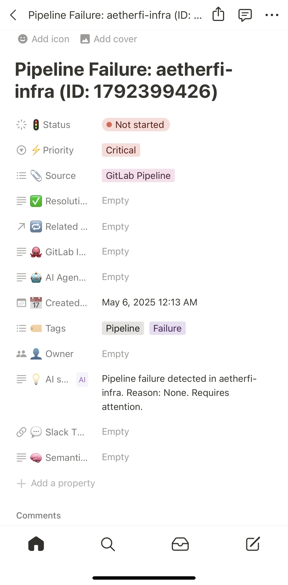
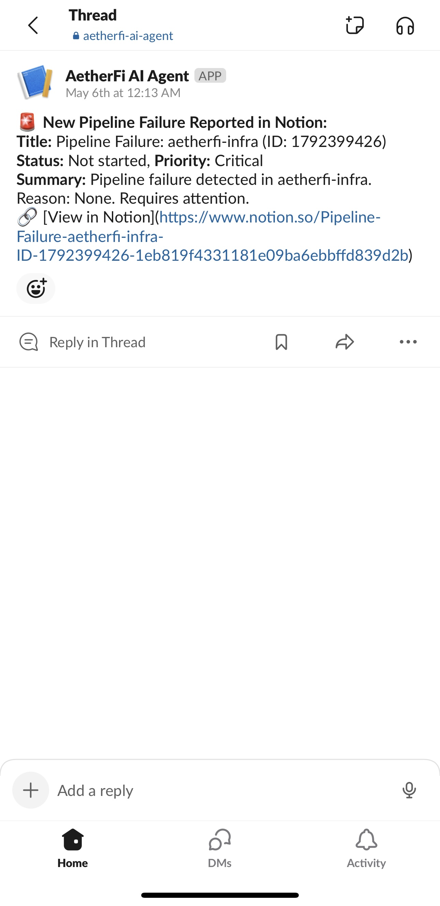

# 📊 AetherFi Observability & Traceability

This document details the tracing, fallback, and dashboard mechanisms powering AetherFi’s AI-enhanced debugging pipeline — from GitLab to Slack to Notion.

---

## ✅ Highlights

- ✅ JSON logs via `logback-spring.xml` with MDC context
- ✅ Circuit breaker fallbacks (`FallbackTriageResponse`)
- ✅ Feign header propagation to Python agents
- ✅ Unit-tested: Filters, controllers, Feign, services
- ✅ Swagger header config planned

---

## 🔐 Request Trace Context

AetherFi tracks every request across its pipeline via custom headers:

| Header           | Purpose                                 |
|------------------|-----------------------------------------|
| `X-Correlation-ID` | Connects webhooks → AI → Notion logs |
| `X-Request-ID`     | Unique ID for retries and tracing     |
| `X-Tenant-ID`      | Multitenant routing placeholder        |

If missing, defaults are generated:

```json
{
  "correlation_id": "aetherfi-vizier-v1-corr-{UUID}",
  "request_id": "aetherfi-vizier-v1-req-{UUID}",
  "tenant_id": "tenant-N/A"
}
```

🧪 Sample JSON Log Output
```json
{
  "@timestamp": "2025-04-24T00:39:59.571337-04:00",
  "level": "INFO",
  "logger_name": "com.aetherfi.vizier.controller.WebhookController",
  "thread_name": "http-nio-8081-exec-1",
  "message": "Received GitLab webhook: { ... }",
  "tenant_id": "aetherfi-vizier-v1-tenant-dev",
  "correlation_id": "aetherfi-vizier-v1-corr-f2915a07",
  "request_id": "aetherfi-vizier-v1-req-cef242ed"
}
```

🛡️ Circuit Breaker Fallback Structure
When downstream AI agents fail or timeout, a standard fallback response is returned:

```json
{
  "message": "Webhook processed",
  "fallbackReason": "RuntimeException: Python unreachable",
  "correlationId": "aetherfi-vizier-v1-corr-abc123",
  "requestId": "aetherfi-vizier-v1-req-def456",
  "tenantId": "tenant-N/A"
}
```

📜 Curl Sample: Traced Request
```bash
curl -X POST http://localhost:8081/webhook/gitlab \
  -H "X-Correlation-ID: test-corr" \
  -H "X-Request-ID: test-req" \
  -H "X-Tenant-ID: tenant-abc" \
  -H "Content-Type: application/json" \
  -d '{ "object_kind": "pipeline", "object_attributes": { "status": "success" }}'
```

📸 Dashboard & Alerts
📊 Grafana-style Dashboard (Mock)

This mocked dashboard shows:

🔥 Total incident count

✅ Resolution rate

⏱️ Avg response time

🔁 Annotated logs with AI-explained root causes
---
## 🗃️ Notion Logging

AI agents log incident summaries and metadata into a centralized Notion database for future triage and RAG memory use.


---
Real-time triage records are auto-logged by the AI agent, including severity, source, and summary.
---
## 🔔 Slack Integration

Each pipeline failure triggers a Slack notification via the AI agent, formatted with critical metadata and Notion links.


---

The AI agent sends alerts with issue context and a link to the Notion ticket.

### ✅ Unit Test Coverage

| Layer         | Description                         | Test Class                     |
|---------------|-------------------------------------|--------------------------------|
| Filter        | Correlation injection + cleanup     | `CorrelationContextFilterTest` |
| Controller    | Webhook parsing & DTO validation    | `WebhookControllerTest`        |
| Service       | Triage orchestration + fallback     | `OrchestrationServiceTest`     |
| Feign Client 

📍 Next Steps
 Add Swagger global header config

 Add Notion + Slack fallback writers

 Apply MDC tracing to RAG agents

 Cloud export for log search via Grafana/Loki

"We don’t just log errors — we trace intent across every layer of the system."


---
